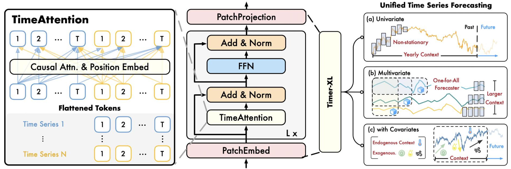
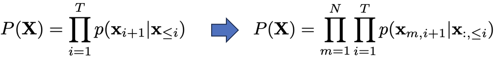
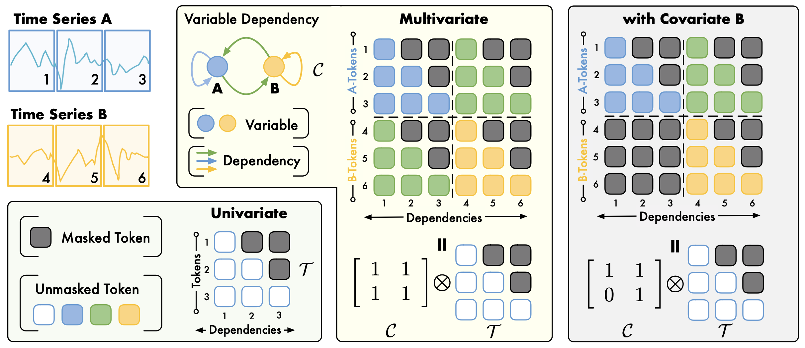
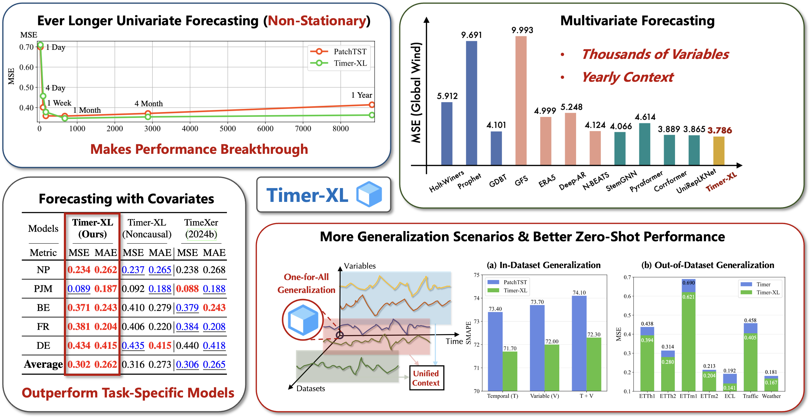

# Timer-XL

Timer-XL: Long-Context Transformers for Unified Time Series Forecasting [[Paper]](https://arxiv.org/abs/2410.04803), [[Slides]](https://cloud.tsinghua.edu.cn/f/2d4b660fc05148dc8f30/), [[Poster]](https://cloud.tsinghua.edu.cn/f/378fbc6f0359460880aa/), [[Intro-CN]](https://mp.weixin.qq.com/s/IFqysOWo1prdjeBpCiNXBg)

:triangular_flag_on_post: **News** (2025.01) Timer-XL has been accepted as **ICLR 2025**. See you in Singapore :)

:triangular_flag_on_post: **News** (2024.12) Released a univariate pre-trained model [[HuggingFace]](https://huggingface.co/thuml/timer-base-84m). A quickstart usage is provided [here](./quickstart_zero_shot.ipynb).

:triangular_flag_on_post: **News** (2024.10) Model checkpoint, training script, and pre-training dataset are released in [[OpenLTM]](https://github.com/thuml/OpenLTM).

## Usage

### Zero-Shot Forecasting

For users interested in zero-shot forecasting, we release a [HuggingFace model](https://huggingface.co/thuml/timer-base-84m) as a out-of-box forecaster.

### Model Adaptation

For developers interested in fine-tuning or training on customized datasets, please refer to [OpenLTM](https://github.com/thuml/OpenLTM) and this [notebook](https://github.com/thuml/OpenLTM/blob/main/load_pth_ckpt.ipynb).


## Introduction

Timer-XL is a decoder-only Transformer for time series forecasting. It can be used for **task-specific training** or **scalable pre-training**, handling **arbitrary-length** and **any-variable** time series.

<p align="center">

</p>

💪 We observe performance degradation of encoder-only Transformers on long-context time series.

💡 We propose **multivariate next token prediction**, a paradigm to uniformly predict univariate and multivariate time series with decoder-only Transformers. 

🌟 We pre-train Timer-XL, a long-context version of time-series Transformers ([Timer](https://github.com/thuml/Large-Time-Series-Model)), for zero-shot forecasting.

🏆 Timer-XL achieves **state-of-the-art** performance as for time series forecasting: [[Univariate]](./figures/univariate.png), [[Multivariate]](./figures/multivariate.png), [[Covariate]](./figures/covariate.png), [[Zero-shot]](./figures/zeroshot.png).

## What is New

> For our previous work, please refer to [**Tim**e-Series-Transform**er** (Timer)](https://github.com/thuml/Large-Time-Series-Model)

**In a word, we generalize next token prediction from 1D sequences to 2D time series.**


### Comparison

| Time-Series Transformers | [PatchTST](https://github.com/PatchTST/PatchTST) | [iTransformer](https://github.com/thuml/iTransformer) | [TimeXer](https://github.com/thuml/TimeXer) | [UniTST](https://arxiv.org/abs/2406.04975) | [Moirai](https://github.com/SalesforceAIResearch/uni2ts) | [Timer](https://github.com/thuml/Large-Time-Series-Model) | [Timer-XL (Ours)](https://github.com/thuml/OpenLTM/blob/main/models/timer_xl.py) |
| ------------------------ | ------------------------------------------------ | ----------------------------------------------------- | -------------------------------------------------------- | --------------------------------------------------------  | --------------------------------------------------------  | --------------------------------------------------------- | ---------------|
| Intra-Series Modeling    | Yes                                              | No                                                    | Yes                                                      | Yes                                                       | Yes                                                      | Yes                                                       | **Yes**         |
| Inter-Series Modeling    | No                                               | Yes                                                   | Yes                                                      | Yes                                                       | Yes                                                      | No                                                        | **Yes**         |
| Causal Transformer       | No                                               | No                                                    | No                                                       | No                                                        | No                                                       | Yes                                                       | **Yes**         |
| Pre-Trained              | No                                               | No                                                    | No                                                       | No                                                        | Yes                                                      | Yes                                                       | **Yes**         |


### Multivariate Next Token Prediction

We generalize next-token prediction for multivariate time series. **Each prediction is made based on tokens of the previous time from multiple variables**:

<p align="center">

</p>

### Universal TimeAttention

We design TimeAttention, a causal self-attention allowing intra- and inter-series modeling while maintaining the causality and flexibility of decoder-only Transformers. It can be applied to univariate and covariate-informed contexts, enabling **unified time series forecasting**.

<p align="center">

</p>

## Main Results

<p align="center">

</p>

## Citation

If you find this repo helpful, please cite our paper. 

```
@article{liu2024timer,
  title={Timer-XL: Long-Context Transformers for Unified Time Series Forecasting},
  author={Liu, Yong and Qin, Guo and Huang, Xiangdong and Wang, Jianmin and Long, Mingsheng},
  journal={arXiv preprint arXiv:2410.04803},
  year={2024}
}
```

## Acknowledgment

We appreciate the following GitHub repos a lot for their valuable code and efforts:

- Time-Series-Library (https://github.com/thuml/Time-Series-Library)
- Large-Time-Series-Model (https://github.com/thuml/Large-Time-Series-Model)
- AutoTimes (https://github.com/thuml/AutoTimes)

## Contact

If you have any questions or want to use the code, feel free to contact:

* Yong Liu (liuyong21@mails.tsinghua.edu.cn)
* Guo Qin (qinguo24@mails.tsinghua.edu.cn)

## License

This model is licensed under the Apache-2.0 License.
